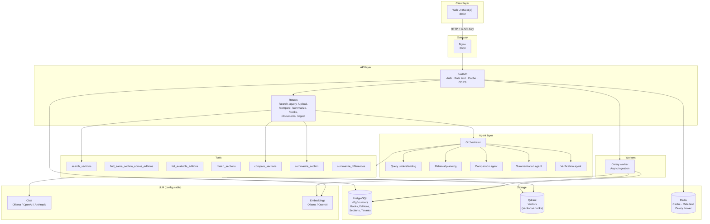
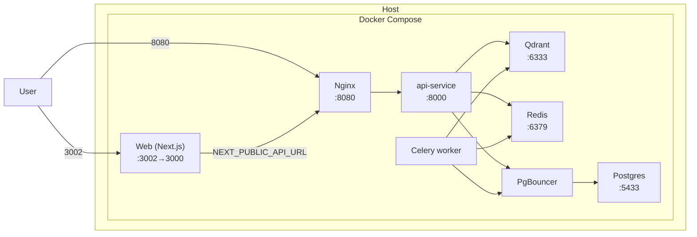
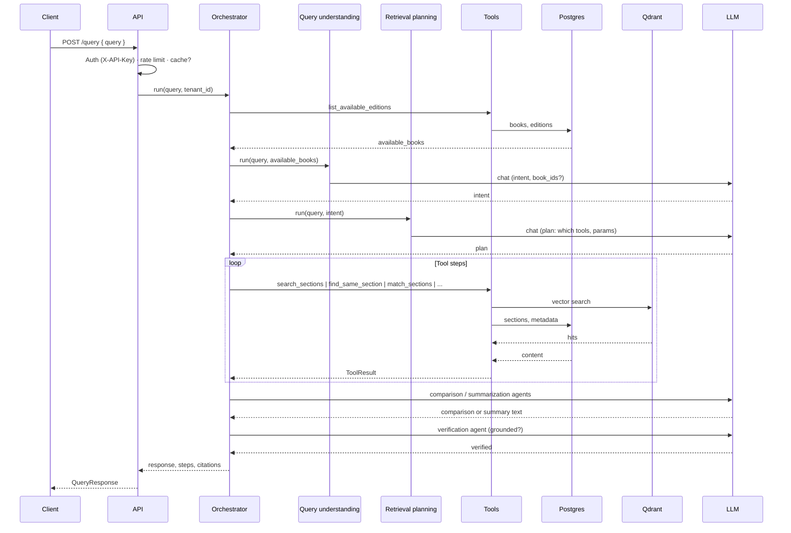
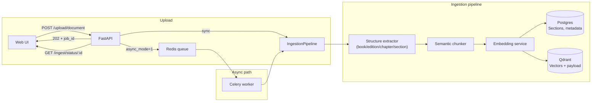
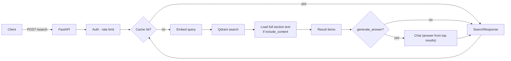
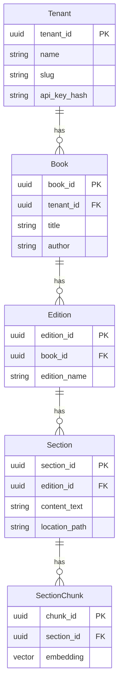

# Agentic RAG — System Design Diagram

High-level architecture, components, and main flows. Render the Mermaid blocks in GitHub, VS Code, or [Mermaid Live](https://mermaid.live).

---

## 1. System overview (components)

---

## 2. Deployment (Docker)

---

## 3. Query pipeline (POST /query)

Natural-language question → understand intent → plan retrieval → run tools → compare/summarize → verify → response.

---

## 4. Upload and ingestion

Document (PDF/TXT) → parse → structure → chunk → embed → store in Postgres + Qdrant. Sync or async (Celery).

---

## 5. Search flow (POST /search)

Direct vector search with optional LLM-generated answer.

---

## 6. Data model (simplified)

---

## 7. Config / env (main knobs)

| Layer    | Env / config |
|----------|----------------|
| **API**  | `API_PORT`, `REQUIRE_AUTH`, rate limits, cache TTL |
| **Chat** | `CHAT_PROVIDER` (ollama / openai / anthropic), `OPENAI_API_KEY`, etc. |
| **Embed**| `EMBED_PROVIDER` (ollama / openai), `OPENAI_EMBED_MODEL` |
| **DB**   | `POSTGRES_*`, PgBouncer in Docker |
| **Vector** | `QDRANT_*`, embedding dimension from embed provider |
| **Frontend** | `NEXT_PUBLIC_API_URL`, `NEXT_PUBLIC_AGENT_API_KEY` |

For more detail see [ARCHITECTURE_AND_DESIGN.md](ARCHITECTURE_AND_DESIGN.md), [GETTING_STARTED.md](GETTING_STARTED.md), and [.env.example](../.env.example).
