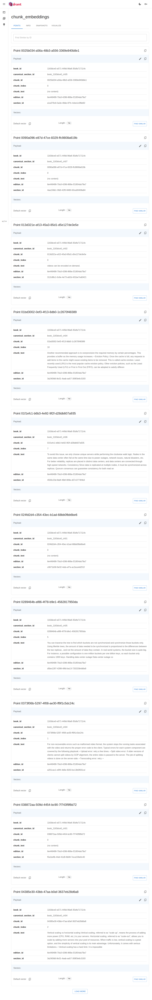

# Technology Stack

A concise overview of the tools and technologies used in Agentic RAG. This helps you understand dependencies, port requirements, and where to look when you need to change behavior.

---

## Runtime and language

| Tool | Role |
|------|------|
| **Python 3.11+** | Application language. Async I/O for the API and storage clients. |
| **uv / pip** | Package and dependency management. Use `uv sync` or `pip install -e ".[dev]"` for local development. |

---

## API and application server

| Tool | Role |
|------|------|
| **FastAPI** | HTTP API framework. Handles routing, validation, OpenAPI docs at `/docs`, and dependency injection (auth, rate limit). |
| **Uvicorn** | ASGI server that runs the FastAPI app in production and development. |

---

## Data stores

| Tool | Role |
|------|------|
| **PostgreSQL** | Persistent metadata: tenants, books, editions, sections (and full section text). The API and Celery workers use it. |
| **Qdrant** | Vector store for embeddings. Used for semantic search and filtering by tenant, book, and edition. |
| **Redis** | Rate-limit counters, search/query cache (TTL), Celery broker, and ingest job status. |

Qdrant stores section and chunk embeddings; you can inspect collections and points in the Qdrant UI (default http://localhost:6333/dashboard).

---

## LLM and embeddings

| Tool | Role |
|------|------|
| **Ollama** | Default provider for embeddings and chat. Runs locally; no API key required. Models (e.g. `nomic-embed-text`, `llama3.2`) are configured via env. |
| **OpenAI** (optional) | Alternative for chat and/or embeddings. Set `CHAT_PROVIDER=openai` or `EMBED_PROVIDER=openai` and provide an API key. |
| **Anthropic** (optional) | Alternative for chat (e.g. Claude). Set `CHAT_PROVIDER=anthropic` and provide an API key. |

See [Models and observability](MODELS_AND_OBSERVABILITY.md) for switching providers and models.

---

## Background jobs

| Tool | Role |
|------|------|
| **Celery** | Async task queue. Ingestion runs as a Celery task when you upload with `async_mode=1`, so the API returns quickly and the worker does the heavy work. |
| **Redis** | Used as the Celery broker (and result backend for job status). |

---

## Production infrastructure (optional)

| Tool | Role |
|------|------|
| **Nginx** | Reverse proxy and load balancer in front of the API. Publishes the API on port 8080; you can run multiple API replicas behind it. |
| **PgBouncer** | Connection pooler for Postgres. Keeps connection count under control when many API and worker processes connect. |

---

## Frontend (optional)

| Tool | Role |
|------|------|
| **Next.js** | Web UI for uploading documents, searching, comparing, and running the query pipeline. Served on port **3002** (Docker, via `WEB_PORT`) or 3000 (local dev). Talks to the API via `NEXT_PUBLIC_API_URL`. |

---

## Observability

| Tool | Role |
|------|------|
| **Prometheus** | Metrics format. The API exposes `GET /metrics` in Prometheus text format (request count, latency histogram). Scrape this endpoint to monitor the API. |
| **Structlog** | Structured JSON logging. Each request is logged with `request_id`, `tenant_id`, endpoint, status, and duration. |

---

## Development and testing

| Tool | Role |
|------|------|
| **pytest** | Unit and integration tests. |
| **httpx** | Used in validation scripts and tests to call the API. |
| **Docker Compose** | Orchestrates Postgres, Qdrant, Redis, PgBouncer, Nginx, API, Celery worker, and optional Ollama and web UI. |

---

## Where it lives in the repo

| Layer | Directory | Main components |
|-------|-----------|-----------------|
| Config | `config/` | `settings.py` (env-backed), Ollama/Qdrant YAML if used |
| API | `src/api/` | `main.py`, routes, auth, rate limit, cache, metrics, middleware |
| Agents & tools | `src/agents/`, `src/tools/` | Orchestrator, query/retrieval/comparison/summarization agents; search, compare, summarize tools |
| Storage | `src/storage/` | Postgres client, Qdrant client, Redis client, SQLAlchemy models |
| Ingestion | `src/ingestion/` | Pipeline, structure extraction, chunking, section IDs |
| LLM | `src/llm/` | Embeddings, chat client (Ollama/OpenAI/Anthropic), prompt templates |
| Worker | `src/worker/` | Celery app, ingest task |
| Docker | `docker/` | Dockerfiles for API, ingestion, web; `nginx.conf` |
| Scripts | `scripts/` | create_tenant, ingest_book, chat, validation scripts |

For a deeper design overview, see [Architecture & design](ARCHITECTURE_AND_DESIGN.md).
