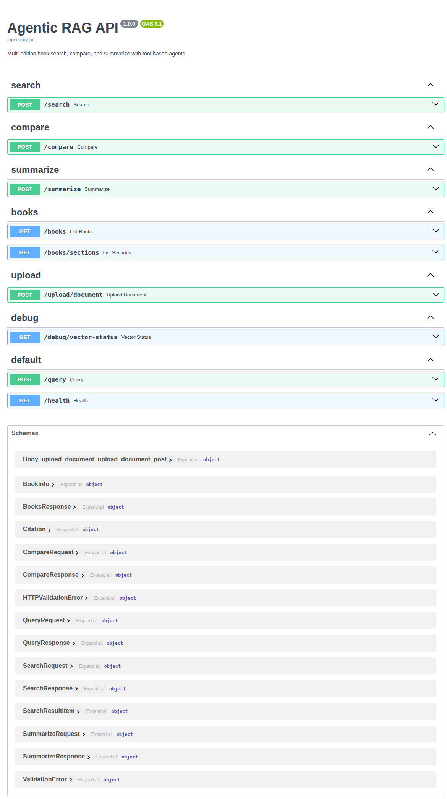

# API Reference

Complete reference for the Agentic RAG HTTP API. The service exposes REST endpoints for health, document upload, search, comparison, summarization, and a full agentic query pipeline.

**Base URL:** **http://localhost:8000** (API on port 8000). With Docker+Nginx use **http://localhost:8080** (or `API_PORT` in `.env`).

### Key URLs (no auth)

| Purpose | URL |
|--------|-----|
| Health | http://localhost:8000/health |
| Swagger UI | http://localhost:8000/docs |
| API info | http://localhost:8000/info |
| Metrics | http://localhost:8000/metrics |

**Interactive docs:** Open **http://localhost:8000/docs** for Swagger UI (use 8080 when behind Nginx).  
**Metrics:** Returns **404** when `METRICS_ENABLED=false`; set to `true` in `.env` and restart to enable.



---

## Authentication

When `REQUIRE_AUTH=true` (default in production), every protected request must include the tenant API key:

```http
X-API-Key: <your-api-key>
```

Create a tenant and obtain a key with:

```bash
POSTGRES_HOST=localhost POSTGRES_PORT=5433 uv run python -m scripts.create_tenant "Tenant Name" slug
```

If you set `REQUIRE_AUTH=false` (e.g. for local development), the API uses a default tenant and the header is optional. Endpoints **GET /health**, **GET /metrics**, **GET /** and **GET /info** do not require auth.

---

## Endpoints

### Root, health, info, and metrics

| Method | Path | Auth | Description |
|--------|------|------|-------------|
| GET | `/` | No | App name and links to `/docs`, `/health`, `/info`. |
| GET | `/health` | No | Liveness/readiness. Returns `{"status": "ok", "version": "1.0.0"}`. |
| GET | `/info` | No | App name, version, and flags: `auth_required`, `metrics_enabled`. |
| GET | `/metrics` | No | Prometheus-format metrics (request count, latency). Returns 404 if `METRICS_ENABLED=false`. |

---

### Books and documents

| Method | Path | Auth | Description |
|--------|------|------|-------------|
| GET | `/books` | Yes | List all books and their editions (legacy). Response: `{ "books": [ { "book_id", "title", "author", "editions": [ ... ] } ] }`. |
| GET | `/documents` | Yes | List all documents and their editions. Response: `{ "documents": [ { "document_id", "title", "author", "editions": [ ... ] } ] }`. |
| GET | `/books/sections` | Yes | List sections. Query params: `book_id` (optional), `edition_id` (optional). |
| GET | `/documents/sections` | Yes | List sections. Query params: `document_id` (optional), `edition_id` (optional). |

---

### Upload and ingestion

| Method | Path | Auth | Description |
|--------|------|------|-------------|
| POST | `/upload/document` | Yes | Upload a document as one edition of a book. **Content-Type:** `multipart/form-data`. **Fields:** `file` (required, .txt or .pdf), `title` (required), `author` (required), `edition_name` (required), `publication_year` (optional), `async_mode` (optional: `1` or `true` for async). Ingested vectors include book/edition/chapter metadata for better search and display. See [Import and metadata](IMPORT_AND_METADATA.md). **Sync:** Returns 200 with `{ "success", "message", "title", "author", "edition_name", "sections_count" }`. **Async:** Returns 202 with `{ "job_id", "message" }`; poll **GET /ingest/status/{job_id}** for status. |
| GET | `/ingest/status/{job_id}` | No | Status of an async ingestion job. Returns 200 with `{ "job_id", "status": "pending" \| "completed" \| "failed", ... }` or 404 if not found or expired. |

---

### Search

| Method | Path | Auth | Description |
|--------|------|------|-------------|
| POST | `/search` | Yes | Semantic search over ingested sections. **Body:** `{ "query": "string", "limit": 10, "document_id": "uuid?", "edition_id": "uuid?", "generate_answer": false, "skip_cache": false }`. **Response:** `{ "success", "results": [ { "section_id", "edition_id", "document_id", "location_path", "content_preview", "score", "book_title", "book_author", "edition_name", "chapter_title", "section_title" } ], "citations": [ { "document_id", "book_title", "chapter_title", "section_title", ... } ], "answer" (if generate_answer=true) }`. Rate-limited and cached per tenant when enabled. |

---

### Compare

| Method | Path | Auth | Description |
|--------|------|------|-------------|
| POST | `/compare` | Yes | Retrieve the same logical section across one or more editions. **Body:** `{ "document_id": "uuid" (or "book_id"), "chapter_number": int?, "section_number": int?, "canonical_section_id": "string?", "edition_ids": ["uuid"]? }`. Provide either `document_id` + (chapter_number, section_number) or `canonical_section_id`; optionally restrict to `edition_ids`. **Response:** `{ "success", "sections": [ ... ], "canonical_section_id", "citations" }`. |

---

### Summarize

| Method | Path | Auth | Description |
|--------|------|------|-------------|
| POST | `/summarize` | Yes | Summarize one section, or differences across multiple sections, or run a query-driven summary. **Body:** `{ "section_ids": ["uuid"]?, "query": "string?", "max_length": 300 }`. If `section_ids` has one id: summarize that section. If two or more: summarize differences. If only `query`: orchestrator runs and returns a summary. **Response:** `{ "success", "summary", "citations" }`. |

---

### Agentic query (full pipeline)

| Method | Path | Auth | Description |
|--------|------|------|-------------|
| POST | `/query` | Yes | Full agentic pipeline: query understanding → retrieval planning → tool execution (search, match, compare, summarize) → optional verification. **Body:** `{ "query": "string", "skip_verification": false, "skip_cache": false }`. **Response:** `{ "response", "steps", "citations", "verified" }`. Results can be cached per tenant when `skip_cache` is false. |

---

### Debug (development)

| Method | Path | Auth | Description |
|--------|------|------|-------------|
| GET | `/debug/vector-status` | Yes | Returns collection info and a sample search result. Useful to confirm Qdrant has data and the tenant filter works. |

---

## Example requests

All examples assume base URL `http://localhost:8080` and, when auth is on, an API key in `X-API-Key`. For form uploads, use `-F` with curl.

**Health and info**

```bash
curl -s http://localhost:8080/health
curl -s http://localhost:8080/info
```

**List books**

```bash
curl -s http://localhost:8080/books -H "X-API-Key: YOUR_KEY"
```

**Search**

```bash
curl -X POST http://localhost:8080/search \
  -H "Content-Type: application/json" \
  -H "X-API-Key: YOUR_KEY" \
  -d '{"query": "introduction to algorithms", "limit": 5}'
```

**Upload document (sync)**

```bash
curl -X POST http://localhost:8080/upload/document \
  -H "X-API-Key: YOUR_KEY" \
  -F "file=@/path/to/book.txt" \
  -F "title=My Book" \
  -F "author=Author" \
  -F "edition_name=2021"
```

**Compare sections**

```bash
curl -X POST http://localhost:8080/compare \
  -H "Content-Type: application/json" \
  -H "X-API-Key: YOUR_KEY" \
  -d '{"book_id": "BOOK_UUID", "chapter_number": 1, "section_number": 1, "edition_ids": ["ED1_UUID", "ED2_UUID"]}'
```

**Agentic query**

```bash
curl -X POST http://localhost:8080/query \
  -H "Content-Type: application/json" \
  -H "X-API-Key: YOUR_KEY" \
  -d '{"query": "Compare chapter 1 section 1 between 2020 and 2022 editions", "skip_verification": true}'
```

---

## Errors and rate limiting

- **401 Unauthorized** — Missing or invalid `X-API-Key` when auth is required.
- **404 Not Found** — Unknown path, or job id not found for **GET /ingest/status/{job_id}**, or **GET /metrics** when metrics are disabled.
- **429 Too Many Requests** — Rate limit exceeded. Response includes `Retry-After` when applicable. Limits are configurable per endpoint (see `.env.example`).
- **5xx** — Server or dependency error (e.g. database or Ollama unavailable). Check logs and [Operations](OPERATIONS.md).

Validation errors (e.g. invalid body or query params) return **422 Unprocessable Entity** with a detail payload.
